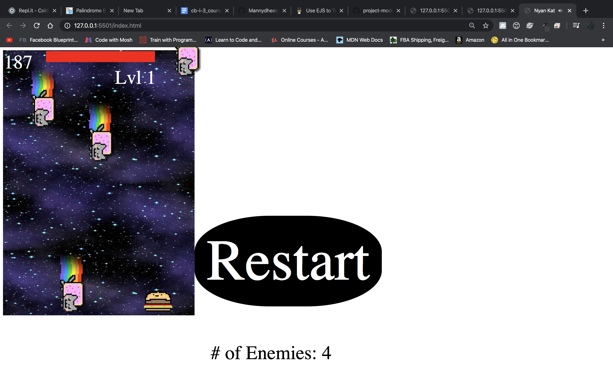
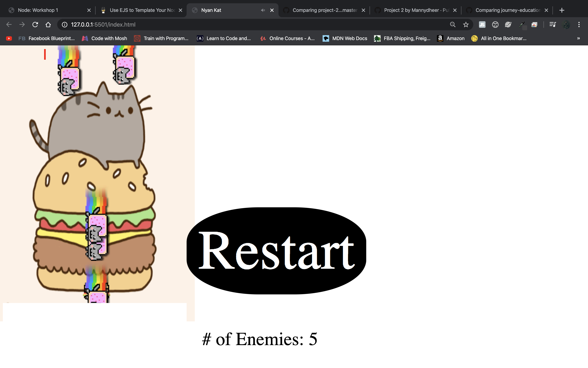

# Object Oriented Programming Game Project

## Features implemented:

1. ScoreBoard top right which will be continuously incrementing.
2. Every 100 points on the scoreboard will lead to a lvl up on the right hand side.
3. As the lvls increase, the number of enemies increase as well (by 1).
4. Added a health bar which will decrease as you get hit.
5. Music that will play and stop as game starts and restarts.
6. Start button
7. Restart button.
8. Up arrow key will allow you to SHOOT a lettuce ICON, unfortunately not 100% perfect. But there is a collision detection which causes the lettuce(bullet) and the nyan cat to be deleted.

Issues: I would like to make the collision for the bullets more accurate.

Improvements: Also I wanted to spend more time on the styling and making it more appealing.